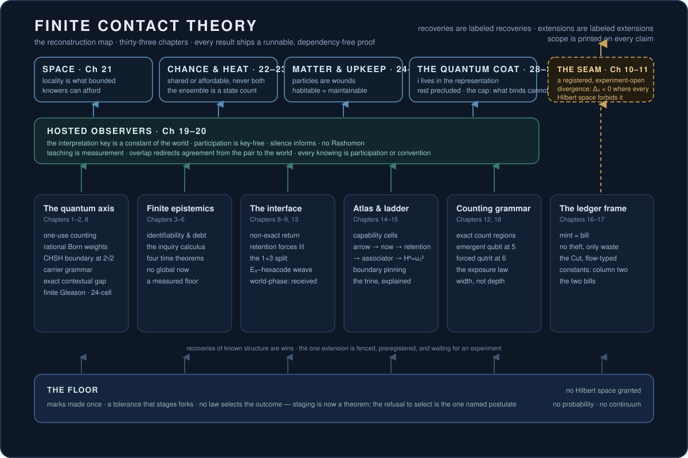

# Finite Contact Theory

[](https://doi.org/10.5281/zenodo.21253591)

> **Reality, rebuilt from a single finite event — and you can run the proofs.**
> Start with the least that can happen when something finite touches what it
> cannot fully take in: a mark, made once, that leaves a difference it cannot
> erase. With no Hilbert space, no probability, no spacetime, and no continuum
> granted at the start, this program grows the machinery of physics back — the
> quantum boundary, the Born rule, contextuality, the structure of time — and
> it ships a dependency-free script for every piece it calls finished.

This is a program with a large ambition and a strict rule. The ambition is to
sort every feature of physical law into what a generative floor *forces* and
what it merely *receives* — a taxonomy of inevitability. The rule is that
nothing enters as a *result* until it is a runnable theorem, a recovery of
known mathematics from the deeper floor, a scoped model result, or a clean,
logged failure. The bold frame and the exact scope are both true at once, and
the difference between them is labeled on every claim.



## What is proven now — three published lines

**The quantum-facing axis** grows a fragment of quantum mechanics from pure
finite counting: one-use contact → coherent counting → one-receiver gluing →
rational Born weights → the CHSH/Pell boundary at `2√2` → a native carrier
grammar → a behavior-conditioned contextual capacity with an exact strict
preparation gap (Chapters 1–2).

**The finite-epistemics axis** builds the calculus of description and asking:
the identifiability and debt law (identifying one of `m` alternatives costs
exactly `⌈log₂ m⌉` receipt bits, and no symmetry-respecting rule can select),
the inquiry calculus and its second law of asking (`EC = H + KL + O`), four
theorems disassembling time (no derivable "now"; an arrow without
thermodynamics; lawfulness without foundation), and a measured generative
floor with an independent-implementation agreement (Chapters 3–6, mapped in 7).

**The contact-interface reconstruction** (Chapter 8, new in v0.8) is the
newest and, for a quantum-foundations reader, the sharpest. From a *retained*
contact interface — one whose second use cannot silently become a non-use —
it derives, entirely by exact finite checks, a single object on which
measurement lives:

- the primitive receiver is the **quaternions** `H` (minimal, irreducible,
  with a unique invariant positive form and a forced 1+3 split);
- its unit states are the **24-cell**, whose polar dual is again a 24-cell —
  an exact self-hosting state/receiver fixed point;
- the combined 48 vectors are the **F₄ root system** (Weyl order 1152);
- every state/receiver contact has the same forced overlap ratio **1/2**;
- a **finite Gleason theorem**: the finite family of measurement contexts
  forces the quadratic Born frame rule `f(x) = tr(ρ Pₓ)`, with *no continuum
  and no continuity assumption*;
- a **triality Kochen–Specker obstruction**: the same finite family admits
  no global noncontextual outcome assignment (exactly sixteen minimal
  nine-context parity proofs, all at the state/receiver interface).

Put the last two side by side and you get the chapter's one sentence: **the
valuation is uniquely lawful exactly where a global pointing is impossible.**
Born valuation and contextuality are not two separate quantum ingredients
here — they are the two faces of one finite closure.

**Chapter 9 (new in v0.9)** extends that line across cells. Independently
generated cells do *not* combine by tensor product: each carries a `D₄`
triality boundary, and cells become one world by settling those boundary
debts into a self-dual code. The unique debt-free two-cell closure is the
**E₈ root system**; local fusion is **octonionic** (its nonassociativity a
pure three-contact receipt); normed fusion stops at the octonions (so the
universe is code-like, not one algebra); the self-dual worlds are the
unitary orbit `|GU(N/2,2)|` (3, 18, 648 through six cells); and six cells
are the first **hidden** world — a hexacode phase whose binding is invisible
to every pairwise and triple probe. The native global object is an evolving
bridge code. **And a forcing audit proves those closure laws are not
floor-selected over matched lawful alternatives** — so the floor forces the
*atlas* of lawful closures and the terminal self-dual *class*, but never the
specific *member* (not statically, via counterworlds like a matched
doubly-even self-dual `[24,12,4]` code, and not dynamically, via a
selection-equivalence theorem). Selection of a world-phase is a conserved,
received input; but *given* an actual phase, counting forces the *form* of
its statistics (a one-parameter equivariant weight family) and its binding
arity — while its Born *magnitude* (equal tickets) and its complex *phase*
remain received, not forced. (Structural, under named closure axioms; nature
is not claimed to realize any of these.)

**Chapter 10 (new in v0.10)** is the program's **first extension** — the first
chapter that does not recover known structure but *predicts a divergence* from
it. Two things, held rigidly apart. **(A) A theorem, unconditional:** a
three-contact class function with a negative sign-sector eigenvalue still keeps
*every* passive-linear-optical probability nonnegative — for **every**
interferometer, lossless or lossy: `152‖z‖² + 9|per A|² − 36|det A|² ≥ 0` for
every complex `3×3` `A`, proven from the toric relation alone (the lossless
`U(3)` core carries a sharper `(7/2)‖z‖²` margin; the `(7/2)` margin for
arbitrary matrices is false and stays killed). So it is a lawful probabilistic
sector that lies **outside** the positive-semidefinite Hilbert Gram cone —
global Hilbert PSD fails while operational block positivity survives. **(B) A prediction, conditional and experiment-open:** on a received
apparatus anchor `r = 3/5`, the odd `Z₂` identity-holonomy sector gives a
negative three-state Gram discriminant `Δ₃ = −64/125 < 0` where ordinary
quantum mechanics forces `Δ₃ ≥ 0`, registered as a joint count vector
`(Δ₃, W, Q₃)` with a frozen protocol, nulls, and kill conditions. This is a
**preregistered bet, not a discovery**: the physical bridge premises (that a
particle class carries `Z₂` identity holonomy, that photons receive it — the
natural home is anyonic/topological matter — that passive linear optics is the
complete grammar) are held open, and the decisive mixed-state PSD-exclusion is
an **open crux awaiting an external quantum-optics expert**. The DOI is an
archival/priority record.

## The live ceiling

The whole release is bounded by one sentence, quoted identically in this
README, the [claim register](docs/public-claim-register.md), the
[chapter-10 paper](papers/10-negative-gram-holonomy/paper.md), and the
[v0.10.0 release notes](RELEASE-NOTES-v0.10.0.md):

> Finite Contact Theory is a finite reconstruction program with a scoped
> theorem stack on three published recovery lines — a quantum-facing axis,
> from one-use contact to counting, one-receiver gluing, rational Born
> weights, the CHSH/Pell boundary, a carrier grammar grown from one-use
> contact, and a behavior-conditioned contextual capacity with an exact strict
> preparation gap; a finite-epistemics axis, from the identifiability and debt
> calculus to the inquiry calculus and its second law of asking, four theorems
> separating the structure of time, and a measured generative floor; and a
> contact-interface reconstruction, in which a retained interface forces a
> quaternionic state/receiver cell whose self-dual closure is the 24-cell and
> the F_4 root system and whose finite measurement calculus forces the
> quadratic Born frame rule (a finite Gleason theorem) exactly where a triality
> Kochen-Specker obstruction forbids a global noncontextual assignment, and in
> which independently generated cells recover the E_8–hexacode closure spine
> under named receiver laws that a forcing audit shows the floor does not
> select over matched lawful alternatives, so the floor forces the atlas of
> lawful closures and the terminal self-dual class but never the specific
> member, and the selection of a world-phase is a conserved, received input —
> and a fourth, first-extension line that is conditional and experiment-open:
> an unconditional accessible-positivity theorem exhibits a three-contact
> sector whose every passive-linear-optical probability is nonnegative yet
> which lies outside the positive-semidefinite Hilbert Gram cone, and on one
> received apparatus anchor this predicts a possible violation of Hilbert-space
> positivity — a negative three-state Gram discriminant Delta_3 < 0 where
> ordinary quantum mechanics forces Delta_3 >= 0 — preregistered with its
> protocol, nulls, and kill conditions — under which the quantum boundary is a
> floor theorem at binary-Bell finite-carrier scope, the preparation gap is an
> exact theorem at KCBS-pentagon scope, the interface reconstruction is a
> finite model-scope recovery on a real-quantum cell, the multi-floor closures
> are model-scope recoveries whose forcing boundary is exactly mapped, the
> accessible-positivity theorem is unconditional while its physical realization
> is a conditional, bridge-premise-gated prediction awaiting a dedicated
> experiment and external expert review, and every unearned generalization —
> complex quantum mechanics, the actuality of one outcome, the universal Born
> rule, whether nature realizes any of these structures, which world-phase is
> selected, and whether nature contains the odd identity-holonomy sector — is
> left open by name; this chapter is an archival priority record of a
> mathematically closed conditional prediction, not an empirical discovery.

The scope fence is the result, not an apology. In particular this does **not**
claim all quantum mechanics is derived: Chapter 8 is a *real-quantum* cell
(`Sym(4,ℝ)`); complex quantum mechanics, the actuality of one outcome, the
universal Born rule, and every nature-facing prediction are held open and
named below.

## Run it yourself (about a minute)

No dependencies beyond Python's standard library.

```powershell
python verification\scripts\run_all.py
```

Expected final line: `ALL SHIPPED VERIFICATION: PASS`. Twelve dependency-free
scripts run — the no-jam core, the rational Born weights, the CHSH ladder
climbing to `2*sqrt(2)` on the Pell fence `p^2 - 2q^2 = -1`, the exact
preparation gap, the debt/asking/time theorems, the floor engine, and — new
in v0.8 — `nonexact_return_reconstruction.py`, which verifies the quaternionic
receiver, the 24-cell self-duality, the F₄ closure, the forced `1/2`, the
finite Gleason theorem, and the triality Kochen–Specker obstruction; and — new
in v0.9 — `multifloor_worldweave.py` (the E₈ two-cell closure, octonionic
fusion, the `|GU(k,2)|` code census, the hexacode) and `forcing_audit.py`
(the counterworlds and the selection-equivalence theorem that map exactly what
the closure does and does not force). All in exact arithmetic in a fraction of
a second. This is the shipped public subset — not the full private corpus.

## Recoveries, honestly named

Chapter 8 lands on objects that mathematicians already know: the Hurwitz
units and the 24-cell, the F₄ root system, Gleason's theorem, and the Peres
24-ray Kochen–Specker set with its Kernaghan-type parity proofs. They are
**recovered here in a derivational role** — forced closures of a retained
contact interface rather than posited apparatus — and named as such. The
novelty claim is only the *composition*: that a contact interface forces this
exact object, and that Born and contextuality are its two faces. Per the
program's discipline, that is graded in the [claim register](docs/public-claim-register.md),
never asserted above its evidence.

## What we killed — and why that is the point

A theory that never discards anything is a mood, not a theory. This one keeps
a public [correction ledger](docs/correction-ledger.md), and the kill count is
a feature. Claims that looked beautiful and died on the evidence include:
binary arity as uniquely forced; matter fixed at dimension 2; closure dynamics
reaching Tsirelson on its own; a simple time-arrow statistic as a nature-facing
bet; graph-floor gravity as a generic divergence from general relativity; raw
record capacity read as memory; the completed continuum as a native object.
Each was pursued hard, then retired under adversarial review. The positive
results here are the ones that survived it.

## The horizon — bold, and not yet proven

Named targets, explicitly *not* results, each entering only as a scoped
theorem, a recovery, a model result, or a clean failure:

- **Complex quantum mechanics** — the projective phase that would complexify
  the Chapter-8 cell (held open).
- **The actuality/update law** — whether a matched non-Born occurrence kernel
  survives on the Chapter-8 object, or one law is forced (a registered next
  question).
- **The multi-floor structure** — how independently generated cells glue
  (the two-floor and many-floor extensions of the F₄ closure).
- **Spacetime, gravity, the continuum, observers, and constants** — the older
  reconstruction horizon, each held open by name.
- **The first nature-facing prediction** — now landed *conditionally* in
  Chapter 10 (v0.10): a preregistered, experiment-open negative-Gram divergence
  from Hilbert positivity, gated by bridge premises and external expert review.
  An empirical *discovery* remains reserved for a future confirmatory
  experiment.

## Read it

1. [papers/10-negative-gram-holonomy/paper.md](papers/10-negative-gram-holonomy/paper.md) — **Chapter 10** (v0.10): negative-Gram identity holonomy — the program's first divergence (an unconditional accessible-positivity theorem + a conditional, experiment-open prediction; the newest result).
2. [papers/09-multifloor-worldweave/paper.md](papers/09-multifloor-worldweave/paper.md) — **Chapter 9** (v0.9): the multi-floor worldweave (E₈, octonions, self-dual codes).
3. [papers/08-nonexact-return/paper.md](papers/08-nonexact-return/paper.md) — **Chapter 8** (v0.8): the non-exact-return reconstruction (finite Born + contextuality).
2. [papers/07-program-map/paper.md](papers/07-program-map/paper.md) — **Chapter 7**: the program map (start here for the whole picture).
3. [papers/02-behavior-conditioned-capacity/paper.md](papers/02-behavior-conditioned-capacity/paper.md) — **Chapter 2**: the exact preparation gap, in standard contextuality language.
4. [papers/finite-contact-theory-v0.1.md](papers/finite-contact-theory-v0.1.md) — **Chapter 1**: the v0.1 release narrative.
5. Chapters 3–6 (the finite-epistemics axis):
   [the debt calculus](papers/03-identifiability-and-debt/paper.md) ·
   [the inquiry calculus](papers/04-inquiry-calculus/paper.md) ·
   [becoming webs](papers/05-becoming-webs/paper.md) ·
   [the measured floor](papers/06-measured-floor/paper.md).
6. [docs/theorem-bank.md](docs/theorem-bank.md) · [docs/public-claim-register.md](docs/public-claim-register.md) — theorem rows and the controlling claim list.
7. [docs/mathematical-core.md](docs/mathematical-core.md) · [docs/glossary.md](docs/glossary.md) · [docs/how-to-read.md](docs/how-to-read.md).

How the repository grows without rewriting its past is [EVOLUTION.md](EVOLUTION.md); what remains open is in [docs/roadmap.md](docs/roadmap.md).

## Verify and audit

```powershell
python verification\scripts\run_all.py   # the shipped theorem subset
python scripts\release_audit.py          # release hygiene: scope, links, no overclaims
```

The audit refuses stale scope language, private paths, and un-scoped overclaim
phrases, and checks the live ceiling verbatim in its advertised locations. The
release is built to feel powerful because it is exact, not because it says too
much — and the bold frame at the top of this page is held to that same audit.

## Status

This is v0.10.0: ten chapters on three recovery lines plus a first extension
line — 61 claim rows (FCT-01..61), 45 theorem rows (T-01..45), fifteen shipped
dependency-free scripts, a public correction ledger, and one live ceiling
sentence. The one nature-facing item — Chapter 10's negative-Gram divergence —
is explicitly conditional, preregistered, and experiment-open (an
archival/priority record, not a discovery). Complex quantum mechanics, the
actuality of one outcome, the universal Born rule, whether nature realizes any
of these structures, spacetime/gravity/continuum, and every *confirmed*
nature-facing claim are deliberately held or open, and named as such.

## Author

- Seth Douglas · ORCID: [0009-0007-4708-3252](https://orcid.org/0009-0007-4708-3252) · [github.com/Apsiape](https://github.com/Apsiape) · apsiape@gmail.com

## Citation

Archived and citable via Zenodo. Cite the program by its **concept DOI**
(always the latest version): [10.5281/zenodo.21253591](https://doi.org/10.5281/zenodo.21253591).
The v0.9.0 version DOI is recorded in
[papers/09-multifloor-worldweave/RELEASE.md](papers/09-multifloor-worldweave/RELEASE.md)
and [CITATION.cff](CITATION.cff) at mint. Earlier version DOIs (v0.1.0–v0.8.0)
are listed in [CITATION.cff](CITATION.cff).

## Rights

This work is licensed under [Creative Commons Attribution-NonCommercial-NoDerivatives 4.0 International (CC BY-NC-ND 4.0)](https://creativecommons.org/licenses/by-nc-nd/4.0/).
You may share it with attribution; you may not use it commercially or
distribute modified versions. For anything beyond that, contact the author.
See [LICENSE.md](LICENSE.md).

## A note from the author

I'm not a physicist. I work in AI and software and follow physics as an
outsider. It didn't start as a theory of physics: it started with one question
I couldn't put down — what is the least that has to exist when something finite
touches something it can't fully take in? A finite thing makes contact with
something larger than itself; the contact is real but partial, so it leaves a
difference, and that difference can't just be wiped away.

The way I chased it is unusual: over about seven months I built a setup where
several AI models work together as a research team and pointed it at that
question. The hardest part was never the physics; it was getting the models to
reach for something new instead of repeating what they were trained on. This is
the piece that has been made public so far, with more built out privately that
I'll share as it's ready. An AI-assisted theory from someone outside the field
is easy to doubt — that's fair, and it's exactly why everything here is scoped,
labeled, and runnable. If I've gotten something wrong, I want to know:
apsiape@gmail.com.
