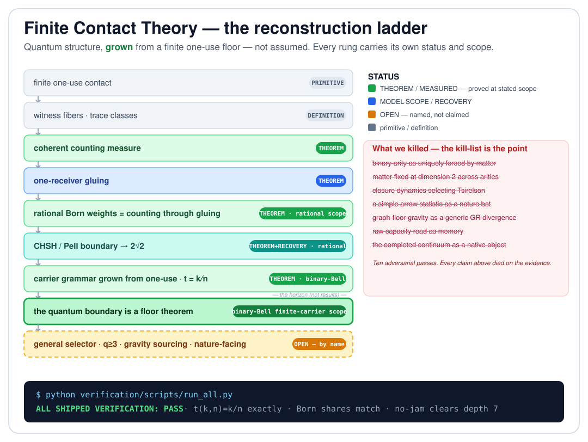

# Finite Contact Theory

[](https://doi.org/10.5281/zenodo.21253591)

> **Quantum mechanics, not assumed — grown.**
> From a finite floor of one-use marks, with no Hilbert space, no probability,
> and no continuum granted at the start, this program reconstructs the
> CHSH/Bell arena, the Born rule as counting, and the Tsirelson boundary — and
> generates the quantum carrier grammar itself — machine-verified at
> binary-Bell scope.

Most attempts to rebuild physics from something deeper ask you to take a lot on
faith. This one hands you a script. Run it and watch a fragment of quantum
mechanics fall out of pure finite counting, with the exact edge of the result
printed on the screen — then read the list of everything we killed to get here.

**This is v0.7 — seven published chapters on two axes.** The
*quantum-facing axis*: Chapter 1 (v0.1) grew the Bell/CHSH quantum boundary
from a finite one-use floor; Chapter 2 (v0.2) added the
**behavior-conditioned capacity** and an exact **strict preparation gap**,
proved in rational arithmetic
([papers/02-behavior-conditioned-capacity/](papers/02-behavior-conditioned-capacity/paper.md)).
The *finite-epistemics axis*, new in this consolidation round: Chapter 3
(v0.3) — the **identifiability and debt calculus** (a description suffices
exactly when its kernel respects the purpose; identifying one of `m`
alternatives costs exactly `ceil(log2 m)` receipt bits, and no
symmetry-respecting rule can make the selection); Chapter 4 (v0.4) —
**questions as operators** and a second law of asking
(`EC = H + KL + O`: nothing identifies below entropy); Chapter 5 (v0.5) —
**time disassembled** into four independent theorems (no derivable "now";
law-time covers visible-time; an arrow with no thermodynamics; lawfulness
without foundation); Chapter 6 (v0.6) — a **measured generative floor**: a
complete public engine with three fenced measurements, including an
independent-implementation agreement with the private laboratory at 0.927.
Chapter 7 (v0.7) is the map. Everything past these chapters (spacetime,
gravity, the continuum, the general quantum case, and every nature-facing
prediction) is held open by name. The point of a chapter is that you can
check it now.



## Run it yourself (about 30 seconds)

No dependencies beyond Python's standard library.

```powershell
python verification\scripts\run_all.py
```

Expected final line:

```text
ALL SHIPPED VERIFICATION: PASS
```

Along the way it runs ten dependency-free scripts: the no-jam core clearing
depth 7; the rational Born weights matching their counting shares; the CHSH
ladder climbing to `2*sqrt(2)` on the exact Pell fence `p^2 - 2q^2 = -1`;
the complementarity angle `t(k,n) = k/n`, exactly; the chapter-2 strict
preparation gap certified in exact rational arithmetic; the chapter-3
waist/debt/continuation theorems; the chapter-4 asking algebra and its
second law; the chapter-5 time theorems (torsor, helix, ledger arrow,
Möbius twist); and the chapter-6 floor engine growing 18 worlds and passing
its three measurement fences. This reproduces the shipped public subset —
not the full private corpus. (Runtime: about a minute.)

## The one claim

The whole release ceiling is a single sentence, and it is quoted identically
in the chapter-7 paper, the claim register, and the release notes:

> Finite Contact Theory is a finite reconstruction program with a scoped
> theorem stack on two published axes — a quantum-facing axis, from one-use
> contact to counting, one-receiver gluing, rational Born weights, the
> CHSH/Pell boundary, a carrier grammar grown from one-use contact, and a
> behavior-conditioned contextual capacity with an exact strict preparation
> gap; and a finite-epistemics axis, from the identifiability and debt
> calculus to the inquiry calculus and its second law of asking, four
> theorems separating the structure of time, and a measured generative
> floor — under which the quantum boundary is a floor theorem at
> **binary-Bell finite-carrier scope**, the preparation gap is an exact
> theorem at **KCBS-pentagon scope**, every epistemics and time result is a
> finite machine-checked theorem or a fenced measurement at its stated
> model scope, and every unearned generalization is left open by name.

The scope fence is not an apology. It is the result. We tell you precisely how
far the proof reaches; that edge is the theorem. In particular this does **not**
claim that all quantum mechanics is derived — the general selector, `q >= 3`
carriers, cross-site interlocking, and every nature-facing prediction are held
open and named below.

## What we killed — and why that is the point

A theory of everything that never discards anything is not a theory; it is a
mood. This one keeps a public [correction ledger](docs/correction-ledger.md),
and the kill count is a feature, not an embarrassment. Claims that looked
beautiful and died on the evidence include:

- binary arity as uniquely forced by a matter–memory coincidence;
- matter fixed at dimension 2 across arities;
- closure dynamics reaching the Tsirelson value on its own;
- a simple time-arrow statistic as a nature-facing bet;
- graph-floor gravity as a generic divergence from general relativity;
- raw record capacity read as memory;
- the completed continuum as a native object.

Each was pursued hard, then retired under adversarial review. The positive
results in this repository are the ones that survived that discipline.

## The ladder — each rung earns its own label

```text
finite one-use contact                                      [ primitive ]
  -> witness fibers and trace classes                       [ definition ]
  -> coherent counting measure                              THEOREM
  -> one-receiver gluing                                    THEOREM
  -> rational Born weights = counting through gluing        THEOREM  (rational scope)
  -> CHSH / Pell boundary -> 2*sqrt(2)                      THEOREM + RECOVERY (rational scope)
  -> carrier grammar grown from one-use contact, t = k/n    THEOREM  (binary-Bell scope)
  -> the quantum boundary is a floor theorem                (binary-Bell finite-carrier scope)
```

**The counting, Born, CHSH/Pell, and native-carrier rungs each ship an exact
check** — five scripts in all, counting no-totality — so the chain above is not
a promise, it is runnable. Every label and scope is defended in the
[theorem bank](docs/theorem-bank.md) and controlled by the
[public claim register](docs/public-claim-register.md). Nothing is banked on a
single implementation: the no-jam core, for one, was reproduced by an
independent repo-barred replicator before it earned its label.

## The horizon — bold, and not yet proven

These are the possibilities the program is built to attack. They are the
*horizon*, explicitly not results, and each will only enter the theory if it
becomes a scoped theorem, a recovery, a model result, or a clean failure:

- **Quantum structure as a reception theorem** — begun at binary-Bell scope; the general case open.
- **Spacetime as contact bookkeeping** — geometry as what stable coarse reception looks like.
- **Gravity as aperture thermodynamics** — energy and temperature appearing at visible-sector boundaries, not at the floor.
- **The continuum as an admitted completion** — real numbers and Hilbert hosts as overlays whose finite content is reconstructed horizon by horizon.
- **Observers as reception classes** — a bounded pattern of what can be jointly received, not a primitive subject.
- **Constants as biography** — dimensionful constants belonging to a branch's received history, not the forced grammar.

## Read it

0. [papers/07-program-map/paper.md](papers/07-program-map/paper.md) — Chapter 7: the program map (start here for the whole picture).
1. [papers/02-behavior-conditioned-capacity/paper.md](papers/02-behavior-conditioned-capacity/paper.md) — Chapter 2: the exact preparation gap (standard contextuality language).
2. [papers/finite-contact-theory-v0.1.md](papers/finite-contact-theory-v0.1.md) — Chapter 1: the v0.1 release narrative.
2a. Chapters 3–6, the finite-epistemics axis:
   [the debt calculus](papers/03-identifiability-and-debt/paper.md) ·
   [the inquiry calculus](papers/04-inquiry-calculus/paper.md) ·
   [becoming webs](papers/05-becoming-webs/paper.md) ·
   [the measured floor](papers/06-measured-floor/paper.md).
3. [docs/mathematical-core.md](docs/mathematical-core.md) — the formal vocabulary.
4. [docs/theorem-bank.md](docs/theorem-bank.md) — theorem rows and proof sketches.
5. [docs/public-claim-register.md](docs/public-claim-register.md) — every public claim, labeled and scoped.
6. [verification/evidence-manifest.md](verification/evidence-manifest.md) — what evidence is shipped, cited, historical, or held.
7. [docs/finite-contact-theory.md](docs/finite-contact-theory.md) — the extraction plan for the full theory spine: where these chapters sit in the larger program.

Short on time? Start with [docs/how-to-read.md](docs/how-to-read.md), and keep
[docs/glossary.md](docs/glossary.md) open for terms. How the repository grows
without rewriting its past is [EVOLUTION.md](EVOLUTION.md); what remains open
is in [docs/roadmap.md](docs/roadmap.md).

## Verify and audit

```powershell
python verification\scripts\run_all.py   # the shipped theorem subset
python scripts\release_audit.py          # release hygiene: scope, links, no overclaims
```

The audit refuses stale scope language, private paths, and un-scoped overclaim
phrases. The release is designed to feel powerful because it is exact, not
because it says too much.

## Status

This is v0.7.0: seven complete, scoped chapters on two axes — 44 claim rows
(FCT-01..44), 32 theorem rows (T-01..32), ten shipped dependency-free
scripts, a public correction ledger, and one live ceiling sentence. The
general quantum selector, cross-site interlocking, `q >= 3`, n-scaling of
the measured floor, continuum/relativistic structure, and every
nature-facing claim are deliberately held or open, and named as such —
these are chapters, not a finished program.

## How this repository evolves

The theory is alive and this repository is built to grow without rewriting
its past. The rules are short and binding:

- **one canonical repository, released in chapters** — each release is a new
  scoped chapter under [papers/](papers/README.md), tagged and archived with
  its own version DOI; the concept DOI always resolves to the latest state;
- **history is append-only** — claim rows and identifiers are never deleted
  or reused; status changes are logged in place; published chapters are
  frozen at their tag;
- **corrections are public and loud** — demotions and withdrawals go to the
  [correction ledger](docs/correction-ledger.md), and a growing ledger is the
  discipline working, not the theory failing;
- **every release passes the same gate** —
  [docs/release-checklist.md](docs/release-checklist.md), covering scope
  freeze, claim hygiene, clean-clone verification, rights, and metadata.

The full charter — versioning semantics, the private-to-public export rules,
and the citer's contract — is [EVOLUTION.md](EVOLUTION.md).

## Author

- Seth Douglas
- Email: apsiape@gmail.com
- ORCID: https://orcid.org/0009-0007-4708-3252
- GitHub: https://github.com/Apsiape

## Citation

Archived and citable via Zenodo. Please cite the current release as:

> Douglas, S. (2026). *Finite Contact Theory v0.7: The Taxonomy of
> Inevitability — A Program Map* (v0.7.0). Zenodo.
> https://doi.org/10.5281/zenodo.21253591

- **Concept DOI** (always the latest version): [10.5281/zenodo.21253591](https://doi.org/10.5281/zenodo.21253591)
- **Version DOI** (v0.2.0): [10.5281/zenodo.21324301](https://doi.org/10.5281/zenodo.21324301)
- **Version DOI** (v0.1.0): [10.5281/zenodo.21253592](https://doi.org/10.5281/zenodo.21253592)

Machine-readable metadata is in [CITATION.cff](CITATION.cff).

## Rights

This work is licensed under [Creative Commons Attribution-NonCommercial-NoDerivatives 4.0 International (CC BY-NC-ND 4.0)](https://creativecommons.org/licenses/by-nc-nd/4.0/).
You may share it with attribution; you may not use it commercially or
distribute modified versions. For anything beyond that — commercial use or
derivative works — contact the author. See [LICENSE.md](LICENSE.md).

## A note from the author

A bit of honesty about where this comes from. I'm not a physicist. I work in AI
and software, and I follow physics as an outsider. I read and watch a lot, so I
have a decent feel for the open questions, but I don't have the formal training.

It didn't start as a theory of physics anyway. It started with one question I
couldn't put down: what is the least that has to exist when something finite
touches something it can't fully take in? A finite thing makes contact with
something larger than itself. The contact is real but partial, so it leaves a
difference. And once that difference is there, it can't just be wiped away. The
finite thing becomes, in a sense, answerable for it.

I kept pulling on that thread. Not starting from physics, or consciousness, or
big systems, but from that one small event: finite contact with what exceeds
it. For a while I thought of it as finite answerability, the idea that a finite
thing is only being honest if it never pretends it isn't finite. It slowly
turned into what's here: finite contact theory.

I'm not a mathematician either, so the way I chased it is unusual. Over the last
seven months or so I built a setup where several AI models work together as a
research team, and pointed it at that question. It took around 15 private repos
and a lot of dead ends. The hardest part was never the physics. It was getting
the models to reach for something new instead of repeating what they were
trained on.

This is the first small piece of what came out of it, with more built out
privately that I'll share as it's ready. I know an AI-assisted theory from
someone outside the field is easy to doubt. That's fair, and it's exactly why
everything here is scoped, labeled, and runnable. If I've gotten something
wrong, I want to know. And if you'd like to talk or work on this together, I'm
at apsiape@gmail.com.
